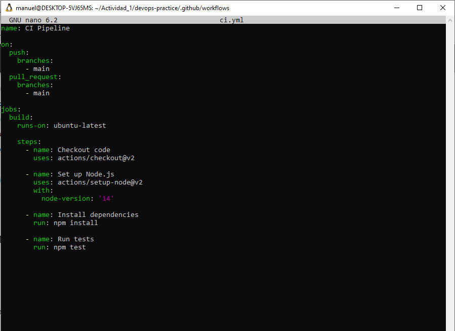

¿Por qué surgió la necesidad de DevOps en el desarrollo de software?/
La necesidad surge al tener un escenario conflictivo por parte de los desarrolladores con el equipo de desarrollo, existiendo un "silo" una carencia de integración o comunicación por parte de ambas areas de trabajo generando ineficiencias en el desarrollo de software.

Explica cómo la falta de comunicación y coordinación entre los equipos de desarrollo y operaciones en el pasado ha llevado a la creación de DevOps./
Al haber una barrera entre estas areas hay un mal manejo de informacion por ende resulta catastrofico unificar partes que no fueron creadas bajo una misma idea, ¿pero que pasa si esta barrera se rompe o desintegra? es claro un mejor rendimiento y resultados optimos, acelerando el flujo de trabajo y llegar al propósito requerido.

Describe cómo el principio de mejora continua afecta tanto a los aspectos técnicos como culturales de una organización./
El principio de mejora continua es la base de DevOps ofreciendo ventajas técnicas o culturales en el desarrollo de software moderno, un pusto de vista técnico, confiabilidad, adaptabilidad y eficiencia en los procesos de entrega. Todo esto fomenta un entorno colaborativo alentando a una cultura de aprendizaje.

¿Qué significa que DevOps no se trata solo de herramientas, individuos o procesos?/
Que independiende de la herramienta, persona o proceso a realizar con la "etiqueta" de DevOps en tu proyecto no significa que hayas logrado DevOps, no es algo puntual o utilizable.

Según el texto, ¿cómo contribuyen los equipos autónomos y multifuncionales a una implementación exitosa de DevOps?/
Su contribución se da con la disolución de barreras para agilizar el flujo de trabajo.

Parte 1:
Inicializacion del proyecto.

le damos la estructura al proyecto.

Editamos el archivo app.js.

app.test.js

Editamos el archivo app.test.js

Navegamos al archivo .json

Editamos el archivo package.json

Configuramos integración continua (CI) con GitHub Actions

Editamos el archivo ci.yml

Iniciamos git

Subimos el codigo a github

Parte 2: Configura entrega continua (CD) con Docker

Creamos el archivo Dockerfile.

Construimos la imagen Docker

Corremos el contenedor localmente

Verificamos el " hello world"

Parte 3: Automatización con Docker Compose
Para facilitar la gestión de tu entorno, puedes usar Docker Compose.
Crea un archivo docker-compose.yml:

Corre la aplicación usando Docker Compose:

hello world

confirmamos la accion del contenedor 

